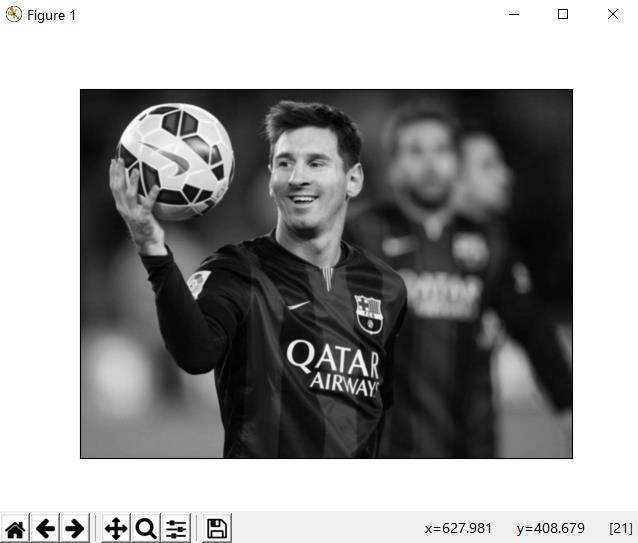

* @author:plsong
* email:781637982@qq.com
# 学习目标
* 学习图和读取、显示、保存图片；
* 学习cv.imread,cv.imshow,cv.imwrite；
* 选学，如何在Matplotlib中显示图片；

# 开始使用OpenCV
## 读取一个图像

使用cv.imread()函数读取图像，图像应该当前的工作路径中，或者给出完整的路径。

第二个参数是一个标识符，选择图片使用那种方式读取
* cv.IMREAD_COLOR:默认的格式。读取一个彩色图像，图像的任何透明度都将被忽略；
* cv.IMREAD_GRAYSCALE:以灰度图像的格式读取；
* cv.IMREAD_UNCHANGED:读取图像，包含alpha通道；

**笔记**: 可以使用1，0，-1替换上述的标志符

请看下面的代码：
```python
import cv2 as cv

#读取图片
img = cv.imread('messi.jpg',0)
```
**注意**：如果给的路径是错误的，opencv不会报错，但是如果print(img)将会得到 None

## 显示图像
使用cv.imshow()函数在窗口中显示图像，窗口会自动适应大小

第一个参数是窗口的名字，第二个参数是图像的名字img，窗口的名字不能相同。
```python
cv.imshow('image',img)
cv.waitKey(0)
cv.destroyAllWindows()
```
然后就可以看到窗口显示的图篇，我是在ubuntu系统下操作的。


* cv.waitKey()是一个与键盘绑定的函数，函数的参数是单位是毫秒。它的功能是等待指定的毫秒数。如果按下键盘的任何一个键，程序就会继续执行。如果参数是‘0’，还可以将其设置为检测特定的键盘输入，例如可以设置为是否输入了‘a’。我们将在后续进行讨论。
* cv.destroyAllWindows():消除我们创建的所有窗口。如果你消除特定的窗口，可以使用cv.destroyWindow(),输入的参数是窗口的名字。

> 笔记
   * cv.waitKey()除了绑定键盘的功能外，还可以用来处理许多其他的GUI事件。所以，你必须使用它来进行显示图片。
   * 有一个特殊情况，你可以在加载图像前创建窗口，使用cv.namedWindow()函数。这时候，你可以制定窗口的大小是否可调。函数的标识符默认是cv.WINDOW_AUTOSISE,是大小自适应的。cv.WINDOW_NORMAL是窗口的大小可调。当图片在维度过大或者添加滑动条的情况下会很有用。

参看下面的程序
```python
cv.nameWindow('image')
cv.imshow('image',img)
cv.waitKey(0)
cv.destroyAllWindows()
```
## 保存图片
使用cv.imwrite()保存图片

第一个参数是要保存成的图片的名称，第二个是要保存的图片。
```python
cv.imwrite('newimg',img)
```
将图片保存到当前目录下，为png格式，
## 总结
参看程序2_1_read_Image.py

```python
"""
author:plsong
email:781637982@qq.com
creat date:2019.11.16
"""

import cv2 as cv

img = cv.imread('../src/messi.jpg',0)
cv.imshow('image',img)
k = cv.waitKey(0)
if k == 27:
    cv.destroyAllWindows()
elif k == ord('s'):
    cv.imwrite('../src/newmessi.jpg',img)
    print('图片已保存')
    cv.destroyAllWindows()
```

**注意**：如果你使用的时64位的操作系统，则你必须将‘k = cv.waitKey(0)’修改为‘k = cv.waitKey(0) & 0xFF’.（但是通过笔者的验证，好像没有影响。就是需要注意的时k = cv.waitKey(0)等待用户输入的时候，键盘要停留在活动窗口中-图片上，在命令行上是不行的）

# 使用Matplotlib

Matplotlib库时python的绘图库，里面包含了多种绘图方法，下面会有详细的说明。你可使用它显示图像，对图像就行缩放，保存图像等操作。请看下面的例子，程序2_2_use_Matplotlib.py。

```python
"""
author:plsong
email:781637982@qq.com
creat date:2019.11.17
"""

import numpy as np
import cv2 as cv
from matplotlib import pyplot as plt
img = cv.imread('../src/messi.jpg',0)
plt.imshow(img, cmap = 'gray', interpolation = 'bicubic')
plt.xticks([]), plt.yticks([])  # 隐藏坐标轴
plt.show()
```

运行结果的截图如下。



**补充 **：Matplotlib库还有很多的功能，详细内容可以翻阅文档查看。还有一些内容，我们可以在以后的学习中遇到。

**注意**：彩色的图像OpenCV读取时是按照BGR的方式读取。但是使用Matplotlib显示的时候是按照RGB的方式。所以使用OpenCV读取的图像，不能直接使用MatplotLib显示。具体细节请看下面的练习。

# 其他资源

[1. Matplotlib使用指南](https://matplotlib.org/api/pyplot_api.html)

# 练习

1. 当你使用OpenCV载入图像而使用Matplotlib显示图像时会遇到一些问题，请阅读这些[讨论](https://stackoverflow.com/questions/15072736/extracting-a-region-from-an-image-using-slicing-in-python-opencv/15074748#15074748)并理解。

最后子修改：2019.11.17 23：04